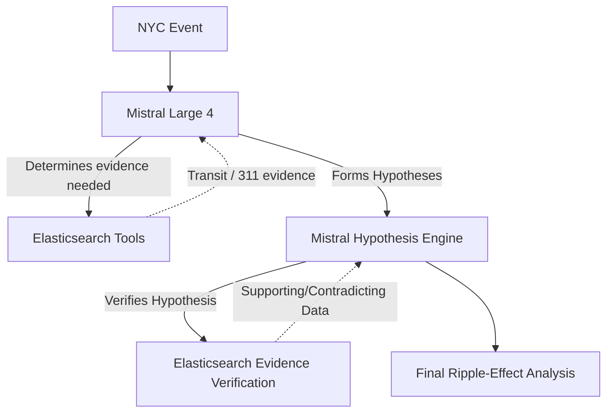

# NYC Pulse

### What happens next?

NYC Pulse is an evidence-driven urban intelligence agent that investigates the likely ripple effects of disruptions across New York City.

**"Elastic gives NYC Pulse memory. Mistral gives NYC Pulse reasoning."**

## Problem
City disruptions (like a subway failure) don't just affect the immediate area—they cause second and third-order ripple effects: displacement of riders, pressure on alternate transit, street congestion, and eventually noise and public safety complaints.

## Idea
Instead of guessing what happens next, NYC Pulse uses an **Evidence Loop**. When given a disruption, a Mistral agent actively queries Elasticsearch for historical data and transit layouts, develops hypotheses for ripple effects, and queries Elasticsearch *again* to find evidence supporting or contradicting those hypotheses.

## Architecture

## Evidence Loop
The core technical differentiator of NYC Pulse. 
We do not use standard RAG (retrieve -> LLM -> answer).
Instead:
EVENT -> Mistral investigates -> Elastic retrieval -> Mistral creates hypotheses -> Elastic evidence verification -> Mistral evaluates evidence -> final grounded answer.

## Elastic Usage
Elasticsearch is the foundation of the system's memory:
- **Full-text search:** Searching historical 311 complaints.
- **Aggregations:** Finding neighborhood baseline signals.
- **Geographic awareness:** Finding nearby subway stops within a radius.

## Mistral Usage
- **mistral-large-latest:** Powers the core reasoning and the Evidence Loop.
- **Function Calling:** Mistral autonomously decides which Elastic tools to call.
- **Structured Outputs:** Final analysis is parsed reliably into a structured dashboard.

## Datasets
- **MTA Subway Schedule (Static GTFS):** Stops and locations.
- **NYC 311 Service Requests:** Millions of historical signals used to back hypotheses with evidence.

## How to run
1. Clone this repository.
2. Install dependencies: `pip install -r requirements.txt`
3. Configure `.env` with:
   - `MISTRAL_API_KEY`
   - `ELASTIC_ENDPOINT`
   - `ELASTIC_API_KEY`
4. Ingest data: `python ingest.py`
5. Run the UI: `streamlit run app.py`

## Demo Scenario
"A major L train disruption happens at Bedford Avenue during evening rush hour. What happens next?"

## Limitations & Future Potential
Currently, NYC Pulse relies on simple keyword and geo-distance queries. In the future, this can be heavily expanded with `mistral-embed` for deep semantic search across the 311 dataset, and real-time MTA live feeds to compare scheduled vs actual system status in real-time.
